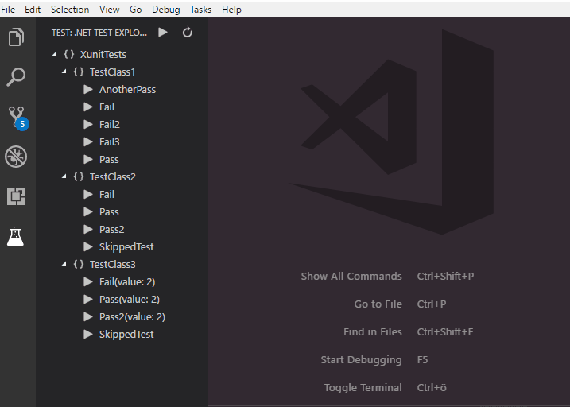

[](https://gitter.im/vscode-dotnet-test-explorer/Lobby)

# .NET Core Test Explorer

## Features

* Test Explorer for .NET Core

## Prerequisites

* [.NET Core](https://www.microsoft.com/net/core) is installed
* NUnit and MsTest requires a dotnet [sdk](https://www.microsoft.com/net/download) version of >= 2.1.2 and running dotnet tooling in english (see [#77](https://github.com/formulahendry/vscode-dotnet-test-explorer/issues/77) for details).

## New in 0.4.0

Status bar shows number of tests discovered, how many tests that are running and test status.


New setting for providing the dotnet test command with additional arguments, see `dotnet-test-explorer.testArguments`.

(Note: `dotnet-test-explorer.build` and `dotnet-test-explorer.restore` settings are removed.)

## Usage

Open a .NET Core test project, or set `dotnet-test-explorer.testProjectPath` to the folder path of .NET Core test project. Then, you will see all the tests in Test Explorer.



## Keyboard shortcuts

* Run all tests, default Alt+R Alt+A

* Rerun last command, default Alt+R Alt+R

* Run test(s) in context, default Alt+R Alt+C

## Settings

* `dotnet-test-explorer.testProjectPath`: Folder path of .NET Core test project. You could set the full path or the relative path to the workspace root path. (Default is **""**)
* `dotnet-test-explorer.useTreeView`: If false, will list all tests as the full namespace. When set to true a tree will be created based on the namespaces of the tests. (Default is **true**)
* `dotnet-test-explorer.showCodeLens`: Determines whether to show the CodeLens test status or not. (Default is **true**)
* `dotnet-test-explorer.codeLensFailed`: The text to display in the code lens when a test has failed. (Default is **""**)
* `dotnet-test-explorer.codeLensPassed`: The text to display in the code lens when a test has passed. (Default is **""**)
* `dotnet-test-explorer.codeLensSkipped`: The text to display in the code lens when a test has been skipped. (Default is **""**)
* `dotnet-test-explorer.pathForResultFile`: The path to (temporarily) store test result files in. (Default is os temp dir)
* `dotnet-test-explorer.autoExpandTree`: If true, the tree will be in an expanded state by default. (Default is **false**)
* `dotnet-test-explorer.addProblems`: If true, failed tests will add to problems view. (Default is **true**)
* `dotnet-test-explorer.autoWatch`: If true, starts dotnet watch test after test discovery is completed. (Default is **false**)
* `dotnet-test-explorer.testArguments`: Additional arguments that are added to the dotnet test command

## Known issues

##### Test result is not shown in codelens / tree
Try and change the setting dotnet-test-explorer.pathForResultFile to point to a folder you have access right too. Code lense functionality also requires the [C# extension](https://marketplace.visualstudio.com/items?itemName=ms-vscode.csharp)) 

##### No tree view or color coded explorer for nunit / mstest
This requieres you to run dotnet sdk version 2.1.2 or higher and running dotnet tooling in english (see [#77](https://github.com/formulahendry/vscode-dotnet-test-explorer/issues/77) for details).

##### DisplayName attribute not working for xunit
See [#56](https://github.com/formulahendry/vscode-dotnet-test-explorer/issues/56)

## Telemetry data

By default, anonymous telemetry data collection is turned on to understand user behavior to improve this extension. To disable it, update the settings.json as below:
```json
{
    "dotnet-test-explorer.enableTelemetry": false
}
```

## Change Log

See Change Log [here](CHANGELOG.md)

## Issues

Currently, the extension is in the very initial phase. If you find any bug or have any suggestion/feature request, please submit the [issues](https://github.com/formulahendry/vscode-dotnet-test-explorer/issues) to the GitHub Repo.
